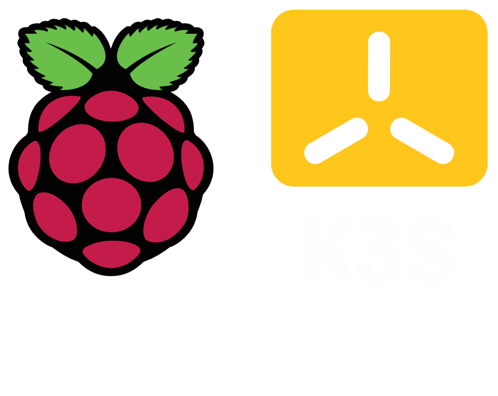

# Kubernetes Learning Journey

  

## Objective

**Why**: To establish a strong foundational knowledge of Kubernetes and to set up a K3s cluster on Raspberry Pi units. The focus is to learn Kubernetes thoroughly and experiment with its various features.

**Goal**: By the end of this journey, aim to have the capability to rapidly instantiate new development and production environments and expose them to the external world with equal ease.

## Table of Contents
- [Hardware](#hardware)
  - [Hardware Components](./docs/hardware-components.md#hardware)
  - [Why These Choices?](./docs/hardware-components.md#why-these-choices)
- [Raspberry Pi's Setup](./docs/raspberry-pi-setup.md#raspberry-pis-setup)
  - [Flash SD Cards with Raspberry Pi OS](./docs/raspberry-pi-setup.md#flash-sd-cards-with-raspberry-pi-os-using-pi-imager)
  - [Initial Boot and Setup](./docs/raspberry-pi-setup.md#initial-boot-and-setup)
  - [Update and Upgrade](./docs/raspberry-pi-setup.md#update-and-upgrade---ansible-playbook)
  - [Disable Wi-Fi](./docs/raspberry-pi-setup.md#disable-wi-fi-ansible-playbook)
  - [Disable Swap](./docs/raspberry-pi-setup.md#disable-swap-ansible-playbook)
  - [Disable Bluetooth](./docs/raspberry-pi-setup.md#disable-bluetooth)
  - [Assign Static IP Addresses](./docs/raspberry-pi-setup.md#assign-static-ip-addresses)
  - [Set SSH Aliases](./docs/raspberry-pi-setup.md#set-ssh-aliases)

- [Automation with Ansible](./SETTING_UP_ANSIBLE.md)

- [K3S Setup](./docs/k3s-setup.md#k3s-setup)
  - [Enable Memory CGroups](./docs/k3s-setup.md#enable-memory-cgroups-ansible-playbook)
  - [Master Node](./docs/k3s-setup.md#setup-the-master-node)
  - [Worker Nodes](./docs/k3s-setup.md#setup-worker-nodes)
  - [Kubectl on local machine](./docs/k3s-setup.md#setup-kubectl-on-your-local-machine)

- [Kubernetes Theory](./docs/kubernetes-theory.md#kubernetes)
  - [What is Kubernetes](./docs/kubernetes-theory.md#1-what-is-kubernetes-)
  - [Kubernetes Components Explained](./docs/kubernetes-theory.md#kubernetes-components-explained)
  - [Control Plane Components](./docs/kubernetes-theory.md#control-plane-components)
  - [Worker Node Components](./docs/kubernetes-theory.md#worker-node-components)
  - [Why Use Kubernetes](./docs/kubernetes-theory.md#2-why-use-kubernetes)
  - [Core Components and Concepts](./docs/kubernetes-theory.md#3-core-components-and-concepts)
  - [Read and Research](./docs/kubernetes-theory.md#5-read-and-research)
  - [Architecture Overview](./docs/kubernetes-theory.md#4-architecture-overview)
  - [Community and Ecosystem](./docs/kubernetes-theory.md#6-community-and-ecosystem)

- [Getting Started with Kubernetes](./docs/getting-started-with-kubernetes.md#gettting-started-with-kubernetes)
  - [Namespace Setup](./docs/getting-started-with-kubernetes.md#namespace-setup)
  - [Basic Deployment](./docs/getting-started-with-kubernetes.md#basic-deployment)
  - [Service Exposure](./docs/getting-started-with-kubernetes.md#service-exposure)
  - [Verify Deployment](./docs/getting-started-with-kubernetes.md#verify-deployment)
  - [Cleanup](./docs/getting-started-with-kubernetes.md#cleanup-wiping-everything-and-starting-over)
  - [Basic Kubernetes Deployments](./docs/getting-started-with-kubernetes.md#basic-kubernetes-deployments)