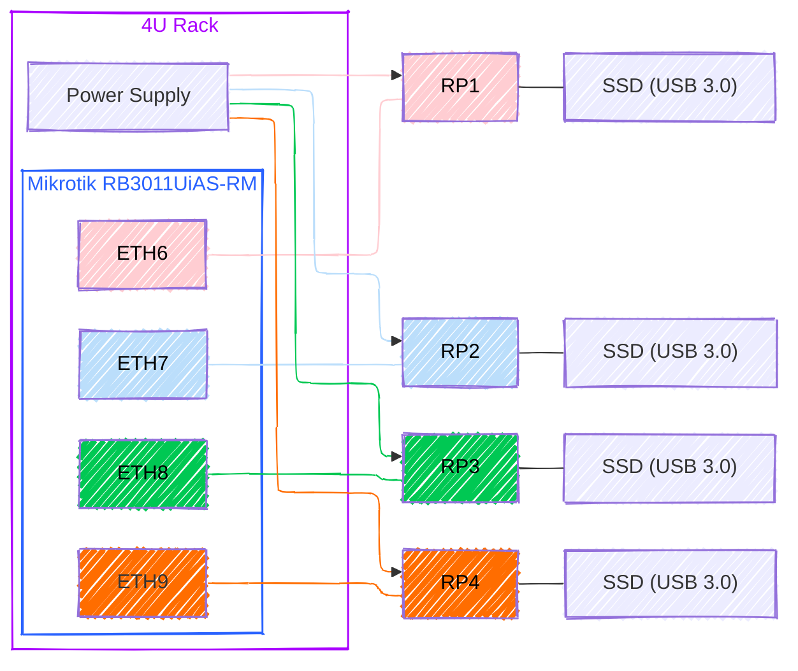

This setup isn't set in stone, it's just my personal choice based on what I've experienced and needed. I wanted something sturdy yet portable, so I went with a 4U Rack to keep everything tidy and easy to connect. I'm planning to expand my cluster with four more Raspberry Pis once the prices drop.

### Raspberry Pi's

**[4x Raspberry Pi 4 B 8GB](https://www.raspberrypi.com/products/raspberry-pi-4-model-b/)**

*Note*: If you're looking to replicate my setup, opt for Raspberry Pi version 4 only if it's available at a significant discount. Otherwise, always go for the latest generation. Also, it's wise to select the model with the maximum RAM since we'll be running multiple services. More memory means better performance.

### Network

**[Mikrotik RB3011UiAS-RM](https://mikrotik.com/product/RB3011UiAS-RM)**: I went with a MikroTik router because it offers professional-grade features at a price that’s hard to beat. It’s packed with options you’d usually only find in high-end gear like Cisco, but without the hefty price tag. The advanced routing, solid firewall, and built-in VPN support made it an easy choice for what I needed.

**[deleyCON 5 x 0.25 m CAT8.1](https://www.amazon.de/-/en/gp/product/B08WPJVGHR/ref=ppx_yo_dt_b_search_asin_title?ie=UTF8&th=1)**: deleyCON CAT 8.1 patch cable network cable as set // 2x RJ45 plug // S/FTP PIMF shielding

**[CSL CAT.8 Network Cable 40 Gigabit](https://www.amazon.de/-/en/gp/product/B08FCLHTH5/ref=ppx_yo_dt_b_search_asin_title?ie=UTF8&th=1)**: CSL CAT.8 Network Cable 40 Gigabit

### Rack

**[4U Rack Cabinet](https://www.compumail.dk/en/p/lanberg-rack-gra-993865294)**: A 4U Rack to encapsulate all components cleanly. It provides the benefit of space efficiency and easy access for any hardware changes or additions.

**[Rack Power Supply](https://www.compumail.dk/en/p/lanberg-pdu-09f-0300-bk-stromstodsbeskytter-9-stik-16a-sort-3m-996106700)**: A centralized power supply solution for the entire rack. Ensures consistent and reliable power distribution to all the components.

**[GeeekPi 1U Rack Kit for Raspberry Pi 4B, 19" 1U Rack Mount](https://www.amazon.de/-/en/gp/product/B0972928CN/ref=ppx_yo_dt_b_search_asin_title?ie=UTF8&psc=1)**: This 19 inch rack mount kit is specially designed for recording Raspberry Pi 4B boards and supports up to 4 units.

### Storage

Some of the storage choices were made based on a combination of overall research and a list of [Known Working Adapters](https://jamesachambers.com/best-ssd-storage-adapters-for-raspberry-pi-4-400/). 

**[4X UGREEN Hard Drive Housing](https://www.amazon.de/dp/B07D2BHVBD?ref=ppx_yo2ov_dt_b_fed_asin_title)**

**[4X Crucial BX500 CT240BX500SSD1 240GB Internal SSD](https://www.amazon.de/dp/B07G3YNLJB?ref=ppx_yo2ov_dt_b_fed_asin_title&th=1)**

**[2x Verbatim Vi550 S3 SSD](https://www.amazon.de/dp/B07LGKQLT5?ref=ppx_yo2ov_dt_b_fed_asin_title&th=1)**

**[2x JSAUX USB 3.0 to SATA Adapter](https://www.amazon.de/dp/B086W944YT?ref=ppx_yo2ov_dt_b_fed_asin_title)**

*During my learning journey with Raspberry Pi, I realized that purchasing microSD cards was a mistake. They perform significantly worse than solid-state drives (SSDs), are prone to random failures, and unfortunately, these microSD cards can be as expensive, or even more so, than buying SSDs. E.g. in comparison, [Verbatim Vi550 S3 SSD](https://www.amazon.de/dp/B07LGKQLT5?ref=ppx_yo2ov_dt_b_fed_asin_title) costs the same as [SanDisk Extreme microSDXC](https://www.amazon.de/dp/B09X7BK27V?ref=ppx_yo2ov_dt_b_fed_asin_title&th=1). In many instances in fact, microSD card is actually more expensive.*

~~**[SanDisk Extreme microSDHC 3 Rescue Pro Deluxe Memory Card, Red/Gold 64GB](https://www.amazon.de/-/en/gp/product/B07FCMBLV6/ref=ppx_yo_dt_b_search_asin_title?ie=UTF8&psc=1)**: Up to 160MB/s Read speed and 60 MB/s. Write speed for fast recording and transferring~~

~~**[Vanja SD/Micro SD Card Reader](https://www.amazon.de/-/en/gp/product/B00W02VHM6/ref=ppx_yo_dt_b_search_asin_title?ie=UTF8&psc=1)**: Micro USB OTG Adapter and USB 2.0 Memory Card Reader~~

### Why These Choices?

**Mobility**: The 4U Rack allows me to move the entire setup easily, making it convenient for different scenarios, from a home office to a small business environment
  
**Professional-Grade Networking**: The Mikrotik router provides a rich feature set generally found in enterprise-grade hardware, offering me a sandbox to experiment with advanced networking configurations
  
**Scalability**: The Raspberry Pi units and the Rack setup are easily scalable. I can effortlessly add more Pis to the cluster

**Affordability**: This setup provides a balance between cost and performance, giving me a powerful Kubernetes cluster without breaking the bank
