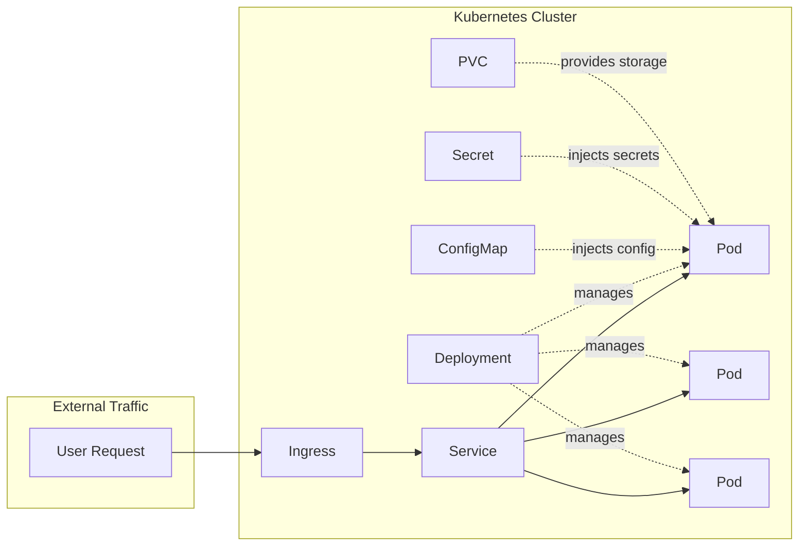

import Alert from '@site/src/components/Alert/index.tsx'
import KubernetesYAMLAnatomy from '@site/src/components/KubernetesYAMLAnatomy/index.tsx'

## What You'll Learn

By the end of this lesson, you'll understand:

- The **four required fields** in every Kubernetes YAML file
- How to read and interpret YAML structure (indentation, arrays, objects)
- How different Kubernetes resources connect and work together
- The purpose of each major resource type (Deployment, Service, Ingress, etc.)
- Common patterns like labels, selectors, and templates

## Why YAML Structure Matters

Understanding Kubernetes YAML files is essential for working with Kubernetes.
These declarative files define nearly every aspect of our infrastructure: how
many instances of an application to run, what type of storage to use, access
controls, networking, and more.

From now on, we should approach these concepts in a straightforward way, because
that's really all there is to it. If we focus too much on terminology and fluff,
it's easy to feel overwhelmed.

> It's important to think about each of these "components" naturally. For
> example: we want to deploy an application with an API and supporting services
> (x, y, z). We might need 10GB of storage for our Postgres database, and we
> want Postgres to be accessible only by our API. Finally, we need to expose our
> API to the internet.

## The Four Required Fields

Every Kubernetes YAML file has four required top-level fields:

- **`apiVersion`**: Specifies the Kubernetes API version to use for this object.
- **`kind`**: Indicates the type of Kubernetes object (e.g., Deployment,
  Service, Ingress).
- **`metadata`**: Provides identifying information such as the object's name,
  namespace, and labels.
- **`spec`**: Contains the desired state and configuration details for the
  object.

These four fields tell Kubernetes **what** you want (`kind`), **which API** to
use (`apiVersion`), **how to identify it** (`metadata`), and **what it should
look like** (`spec`).

## Reading YAML: The Basics

Before diving into Kubernetes-specific YAML, let's understand YAML syntax:

- **Indentation matters**: Use 2 spaces (never tabs). Each level of indentation
  represents nesting.
- **Arrays/Lists**: Use `-` prefix. Example: `- item1` or `- name: value`
- **Key-Value pairs**: Use `key: value` format
- **Strings**: Usually don't need quotes unless they contain special characters
- **Comments**: Start with `#`

```js
# This is a comment
apiVersion: apps/v1 # Key-value pair
kind: Deployment # Another key-value pair
metadata: # Object (nested)
  name: my-app # Nested key-value (2 spaces indent)
  labels: # Another nested object
    app: my-app # Nested under labels (4 spaces)
spec: # Top-level object
  replicas: 3 # Number value
  containers: # Array (list)
    - name: app # Array item (4 spaces, dash)
      image: nginx:latest # Nested under array item (6 spaces)
```

## Interactive YAML Explorer

Explore the different Kubernetes resource types below. Hover over sections in
the YAML code or the explanation cards to see how they connect:

<KubernetesYAMLAnatomy />

<Alert
  title="Helm - The package manager for Kubernetes"
  description="Keep in mind that throughout this entire journey, we will be writing our YAML files manually. In simple terms, we will not be using Helm (the package manager for Kubernetes). In my experience, introducing these abstractions too soon robs us of learning opportunities and understanding how these files are written. Trust this advice: follow this path until you are fully irritated doing it manually. At that point, you'll be ready to optimize."
  variant="warning"
/>

## How Resources Connect

Kubernetes resources work together to deploy and run applications. Here's how
they connect:



**Flow of traffic:**

1. **Ingress** receives external HTTP/HTTPS traffic and routes it to a
   **Service**
2. **Service** acts as a load balancer, distributing traffic to matching
   **Pods**
3. **Deployment** creates and manages the **Pods** (ensures the desired number
   are running)
4. **ConfigMap** and **Secret** provide configuration and sensitive data to
   **Pods**
5. **PVC** (Persistent Volume Claim) provides persistent storage to **Pods**

## Quick Reference: Resource Types

| Resource       | Purpose                     | Common Use Case                         | Related Resources       |
| -------------- | --------------------------- | --------------------------------------- | ----------------------- |
| **Deployment** | Manages Pod replicas        | Run 3 copies of your app                | Pods, ReplicaSet        |
| **Service**    | Exposes Pods internally     | Allow Pods to talk to each other        | Pods (via selectors)    |
| **Ingress**    | Exposes Services externally | Make your app accessible via HTTP/HTTPS | Service                 |
| **ConfigMap**  | Stores non-sensitive config | Environment variables, config files     | Pods (via volumeMounts) |
| **Secret**     | Stores sensitive data       | Passwords, API keys, certificates       | Pods (via volumeMounts) |
| **PVC**        | Requests persistent storage | Database storage, file uploads          | Pods (via volumes)      |

## Common Patterns

### Labels and Selectors

**Labels** are key-value pairs attached to resources. **Selectors** use labels
to find matching resources.

```yaml
# Deployment uses selector to find Pods
spec:
  selector:
    matchLabels:
      app: my-app # "Find Pods with label app=my-app"
  template:
    metadata:
      labels:
        app: my-app # Pods get this label
```

**Critical rule**: The labels in `spec.selector.matchLabels` must match the
labels in `spec.template.metadata.labels`. This is how the Deployment knows
which Pods to manage.

### Deployment → Pod Template

A Deployment's `spec.template` is a **blueprint** for creating Pods:

```yaml
spec:
  replicas: 3 # "I want 3 Pods"
  template: # "Here's what each Pod should look like"
    metadata:
      labels:
        app: my-app
    spec:
      containers:
        - name: app
          image: nginx:latest
```

Kubernetes uses this template to create Pods. If a Pod dies, Kubernetes creates
a new one using this template.

### Service → Pod Selection

A Service uses a selector to find Pods to route traffic to:

```yaml
spec:
  selector:
    app: my-app # "Route traffic to Pods with app=my-app"
  ports:
    - port: 80
      targetPort: 8080 # Forward to port 8080 on the Pods
```

The Service finds all Pods with matching labels and distributes traffic among
them.

## Try It Yourself

The best way to learn is by doing. Try these exercises:

1. **Validate your YAML**: Copy one of the examples above to a file (e.g.,
   `deployment.yaml`) and validate it:

   ```bash
   kubectl apply --dry-run=client -f deployment.yaml
   ```

2. **Explore the API**: Use `kubectl explain` to discover available fields:

   ```bash
   kubectl explain deployment.spec
   kubectl explain deployment.spec.template.spec.containers
   ```

3. **Find API versions**: Discover which API versions are available:

   ```bash
   kubectl api-resources
   ```

4. **See it in action**: Apply a simple Deployment and watch it create Pods:
   ```bash
   kubectl apply -f deployment.yaml
   kubectl get pods -w  # Watch Pods being created
   ```

Each major configuration area is typically represented by its own YAML file. For
example:

- **Ingress**: Describes how a service is accessed via HTTP and HTTPS.
- **Deployment**: Specifies how many instances (replicas) of an application to
  run, and resource allocations like RAM and CPU.
- **Service**: Defines networking and how other components or users can access
  our application.

Each section plays a specific role in telling Kubernetes what we want to run and
how we want it managed. Mastering these files is key to effectively deploying
and managing applications in Kubernetes.
