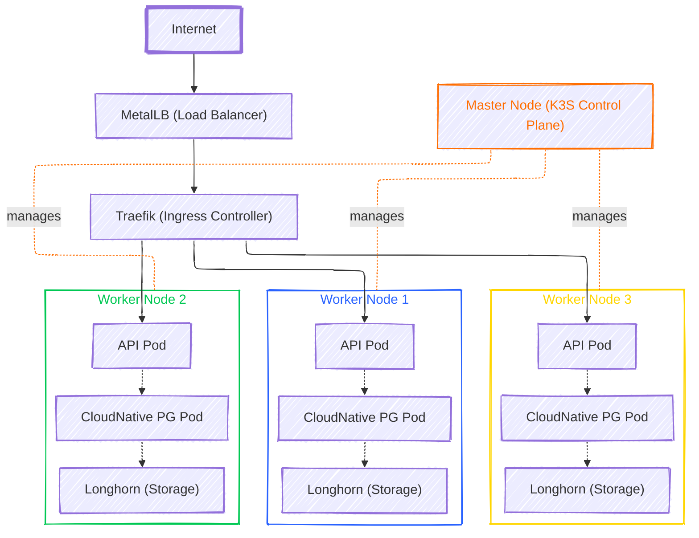

Whenever I'm learning something, I try to think about the outcome first. That's where I usually begin. It's similar to building a product. As Steve Jobs once said, "Start with the customer, and the problem, then work backwards to the technology."

I started learning Kubernetes because I wanted to enable myself to provision infrastructure with minimal effort. If I want to start building a new product and "ship fast, fail fast," infrastructure should be an afterthought. I don't want to spend time thinking about it. I should just write a few small YAML files, hit deploy, and be good to go. I shouldn't have to worry about networking, hard drives, CPUs, Logging etc. I just need an interface where I can say, "Hey, I want XYZ, give it to me.

With that in mind, this will be the outcome of this course: By the end, we'll have the ability to provision a full-stack application infrastructure in under five minutes. And to top it off, it'll cost us next to nothing, as the only expenses will be the initial investment in the bare-metal server, plus about 5 euros per month for electricity.

